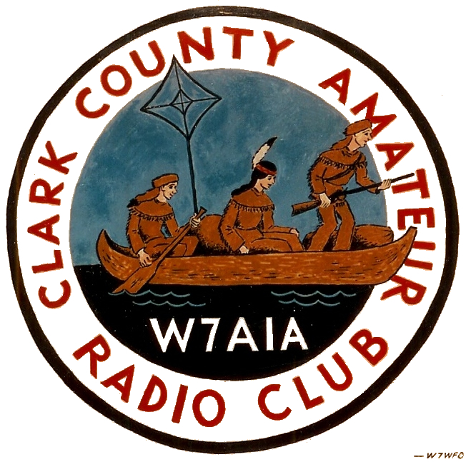

---?image=BG.jpg
## W7AIA Field Day 2017

---?image=BG.jpg
#### Field Day is the premiere event on the radio calendar
* Every June, more than 40,000 hams throughout North America set up temporary transmitting stations in public places to demonstrate ham radio's science, skill and service to our communities and our nation. It combines public service, emergency preparedness, community outreach, and technical skills all in a single event. -**ARRL** 
---?image=BG.jpg
#### Quick Facts
- Our FD Operations (radios on to radios off) run from 11:00 AM to Saturday the 24th to 11:00 AM Sunday the 25th |
- Anyone, including inactive hams can operate the GOTA station |
- You can participate at as many FD sites as you wish, as long as you don't make a QSO between them |
- The site is open to the public from noon to 4:00 PM on the 25th |
- If you want to operate, sign up with Rick KT7G ahead of time |
---?image=BG.jpg
#### FD 2017 Goals
- Have Fun
- Recruit New Hams |
- Gain Public Attention, have 300 + People visit the site |
- Educational Events ~ hold 3 seminars |
- Contact all 50 States |
- Make 1100 Contacts |
- Field 60 radio operators during the 24 hour on-the-air operating period |
- Drink Coffee :) |
---?image=BG.jpg
### Schedule
---?image=BG.jpg
### Friday, June 23rd
<table>
  <tr>
    <th>Time</th>
    <th>Event</th> 
  </tr>
  <tr>
    <td>9:00 AM</td>
    <td>Set up volunteers meet at FD site</td> 
  </tr>
  <tr class="fragment">
    <td>10:00 AM</td>
    <td>Equipment crew meet at FD site</td>
  </tr>
  <tr class="fragment">
    <td>10:00 AM thru 7:00 PM</td>
    <td>Site setup begins</td>
  </tr>
  <tr class="fragment">
    <td>~Noon</td>
    <td>Lunch from Subway</td>
  </tr>
  <tr class="fragment">
    <td>6:00 PM to ?</td>
    <td>BYOR, sign up with Rick Aragon, AE7VP</td>
  </tr>
  <tr class="fragment">
    <td>7:00 PM to 8:00 PM</td>
    <td>Ice cream Social</td>
  </tr>
  <tr class="fragment">
    <td>8:00 PM</td>
    <td>Security shifts begin</td>
  </tr>
</table>
---?image=BG.jpg
### Saturday, June 24th
<table>
  <tr>
    <th>Time</th>
    <th>Event</th> 
  </tr>
  <tr>
    <td>09:00 AM-11:00 PM</td>
    <td>Finalize site setup</td> 
  </tr>
  <tr>
    <tr class="fragment">
    <td>11:00 AM to Midnight</td>
    <td>Field Day Operations active</td>
  </tr>
    <tr>
    <tr class="fragment">
    <td>11:00 AM to 4:00 PM</td>
    <td>GOTA station active</td>
  </tr>
    <tr class="fragment">
    <td>Noon to 4:00 PM </td>
    <td>Site open to the public, club and agency booths active</td>
  </tr>
    <tr>
    <tr class="fragment">
    <td>1:00 PM to 1:50</td>
    <td>EventDave WB7ESV "Mobile Installations"</td>
  </tr>
    <tr>
    <tr class="fragment">
    <td>Time2:00 to 2:50</td>
    <td>EventTentative presentation on the 630 meter band</td>
  </tr>
    <tr>
    <tr class="fragment">
    <td>6:00 PM to 7:30 PM</td>
    <td>Pot Luck</td>
  </tr>
</table>
---?image=BG.jpg
### Sunday, June 25th
<table>
  <tr>
    <th>Time</th>
    <th>Event</th> 
  </tr>
  <tr>
    <td>Midnight to 11:00 AM</td>
    <td>Field Day Operations Active</td> 
  </tr>
    <tr class="fragment">
    <td>8:00 AM to 9:00 AM</td>
    <td>Pancake Breakfast</td>
  </tr>
      <tr class="fragment">
    <td>11:00 AM</td>
    <td>Operations Cease, teardown and cleanup begin</td>
  </tr>
</table>
---?image=BG.jpg
