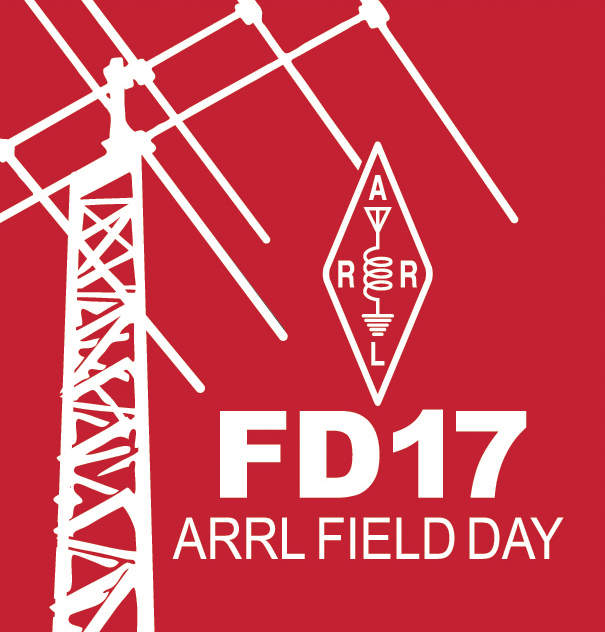

---?image=BG.jpg
## W7AIA Field Day 2017

---?image=BG.jpg
![pic1][FDpic.jpg] 
Field Day is ham radio's open house. Every June, more than 40,000 hams throughout North America set up temporary transmitting stations in public places to demonstrate ham radio's science, skill and service to our communities and our nation. It combines public service, emergency preparedness, community outreach, and technical skills all in a single event. Field Day has been an annual event since 1933, and remains the most popular event in ham radio.
